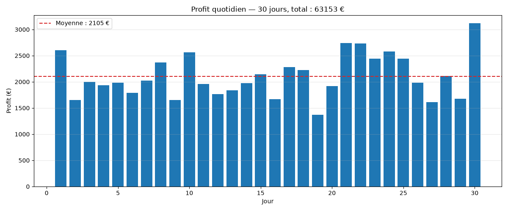

# Battery Arbitrage Optimizer

An algorithmic trading engine for a battery storage asset on the French
day-ahead power market: it decides, for each pricing period, how much to
charge or discharge to maximize profit, subject to the battery's physical
constraints (capacity, max power, round-trip efficiency).

## How it works

Given a day of prices, `optimize_day` solves a linear program (via
[PuLP](https://github.com/coin-or/pulp) + CBC) with perfect foresight:

- **Decision variables**: `charge[t]` and `discharge[t]` (MW) for each period `t`
- **Objective**: maximize `Σ period_hours * price[t] * (discharge[t] - charge[t])`
- **State-of-charge constraint**: `soc[t] = soc[t-1] + period_hours * (charge[t] * charge_efficiency - discharge[t] / discharge_efficiency)`
- **Bounds**: `0 <= charge[t], discharge[t] <= max_power_mw` and `0 <= soc[t] <= capacity_mwh`

`run_backtest` chains `optimize_day` over consecutive days, carrying the
battery's state of charge from the end of one day into the start of the next.

### Data sources

Two sources are used, for two different purposes:

- **RTE's Wholesale Market API** (`fetch_rte_prices`) — gives EPEX day-ahead
  prices for France at 15-minute resolution, but the endpoint takes no query
  parameters: per RTE's own API guide it always returns only today's (or
  tomorrow's, after ~13h French time) prices. It's used for the single-day
  demo only — it cannot serve historical data.
- **ENTSO-E Transparency Platform** (`fetch_entsoe_day_ahead_prices`) — the
  source for historical day-ahead prices used by the backtest. Its XML
  responses can contain duplicate or revised `<TimeSeries>` blocks for the
  same day and some days have gaps (fewer points than a full day); the
  fetch function deduplicates by period start and keeps each day's native
  length and resolution rather than assuming a fixed one.

## Project layout

```
src/battery_arbitrage/
    battery.py      # BatterySpec: physical battery parameters
    optimizer.py     # optimize_day(): the LP optimizer, returns a DispatchResult
    backtest.py      # run_backtest(): chains optimize_day over multiple days
    data.py          # RTE (current day) + ENTSO-E (historical) price fetching
scripts/
    run_single_day.py  # fetch today's RTE prices, optimize, plot the dispatch
    run_backtest.py    # fetch a month of ENTSO-E prices, backtest, plot daily profit
tests/
    test_optimizer.py  # LP correctness (analytic case, SOC bounds)
    test_data.py        # ENTSO-E deduplication logic (mocked, no network)
```

## Setup

```bash
conda create -n battery-arbitrage python=3.11
conda activate battery-arbitrage
pip install -e ".[dev]"
```

On Apple Silicon, PuLP's bundled CBC solver is built for Intel and fails with
`Bad CPU type in executable`. Install a native one via conda-forge:

```bash
conda install -c conda-forge coincbc -y
```

`optimize_day` automatically prefers a system CBC (found via `shutil.which`)
over PuLP's bundled binary when available.

### Credentials

Both are free. Create a `.env` file at the repo root with:

```
RTE_CLIENT_ID=...
RTE_CLIENT_SECRET=...
ENTSOE_API_KEY=...
```

- **RTE**: subscribe to the "Wholesale Market" API at
  [data.rte-france.com](https://data.rte-france.com) to get a
  `client_id`/`client_secret` (instant approval).
- **ENTSO-E**: generate a Web API token from "My Account Settings" →
  "Web API Access" at
  [transparency.entsoe.eu](https://transparency.entsoe.eu).

## Usage

```bash
python scripts/run_single_day.py   # today's dispatch, detailed plot
python scripts/run_backtest.py     # a month of history, daily profit
```

`run_backtest.py` on a month of September 2026 ENTSO-E prices:



## Tests

```bash
pytest
```
